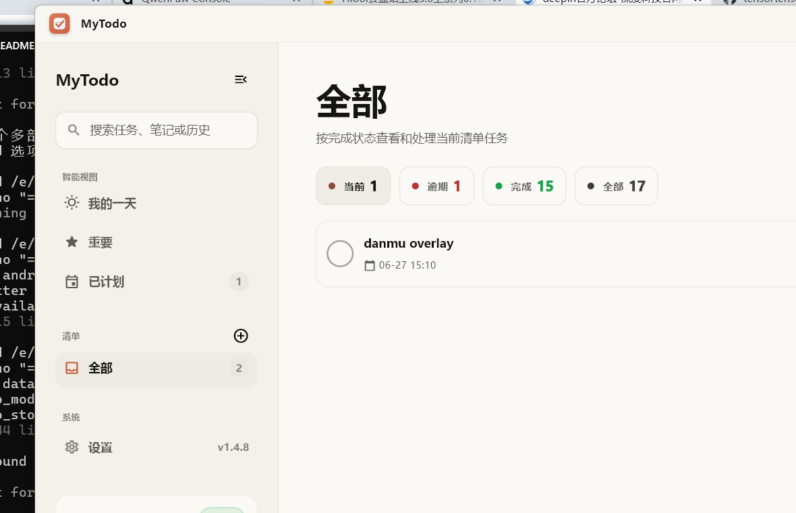
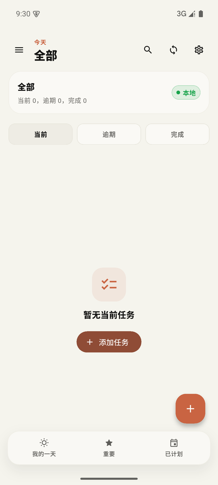

# MyTodo

[中文说明](README.zh-CN.md)

MyTodo is a local-first Flutter TODO app for Windows and Android. It stores data on the device and can optionally sync through your own Supabase project.

## Screenshots

| Windows | Android |
| --- | --- |
|  |  |

## Features

### Task Management
- Create, edit, complete, delete, and restore TODO items.
- Set due dates, reminder times, and track overdue state.
- Mark tasks as important with a star.
- Organize tasks into custom lists with assignable colors.
- Set up daily recurring task templates.
- Drag-and-drop manual task reordering.
- New tasks default to today's due date.

### Views & Filters
- **My Day** — today's tasks from all lists.
- **Important** — starred tasks.
- **Planned** — tasks with a due date.
- **Inbox** and custom lists.
- Filter by current, overdue, and completed tasks.
- History search across current, completed, and deleted tasks.

### Sync & Data
- Optional Supabase remote sync with user-provided project URL and publishable key.
- Automatic remote sync after local changes when configured.
- Pull-to-refresh sync on mobile; top-bar sync button on desktop.
- Export a JSON backup of all tasks and lists.

### Desktop
- Two-pane layout with list navigation and task detail.
- Windows system tray with show, hide, sync, and quit actions.
- Windows 11 Fluent Design style with a warm minimal color scheme.
- In-app update checking with GitHub downloads and domestic mirror options.
- Windows installer and portable zip packaging.

## Download

Download the latest APK, Windows installer, or Windows zip from:

https://github.com/tensortensor666/MyToDo/releases/latest

For most Android phones, use the `arm64-v8a` APK. Use the Windows installer for normal desktop installation, or the Windows zip for portable use.

## Build

**Prerequisites:** Flutter 3.44+ / Dart 3.12+

```powershell
flutter pub get
flutter test
flutter build apk --release --split-per-abi --obfuscate --split-debug-info=build/symbols/android
flutter build windows --release
```

## Release

Push a version tag to build and publish a GitHub Release automatically:

```powershell
git tag -a v1.4.9 -m "MyTodo 1.4.9"
git push origin main
git push origin v1.4.9
```

The [release workflow](.github/workflows/release.yml) uploads split Android APKs, a Windows x64 zip, a Windows installer, and SHA256 checksums.

## Docs

- [Product Roadmap](docs/PRODUCT_ROADMAP.md)
- [UI Improvement Guide](docs/UI_IMPROVEMENT_GUIDE.md)
- [Android Release Signing](docs/android_release_signing.md)
- [Supabase Schema](docs/supabase_schema.sql)

## Tech Stack

- **Framework:** Flutter 3.44+
- **UI:** Fluent UI 4.16 + Material
- **Database:** SQLite (sqflite)
- **Sync:** HTTP + Supabase REST API
- **Platforms:** Windows, Android

## License

MIT — see [LICENSE](LICENSE).
