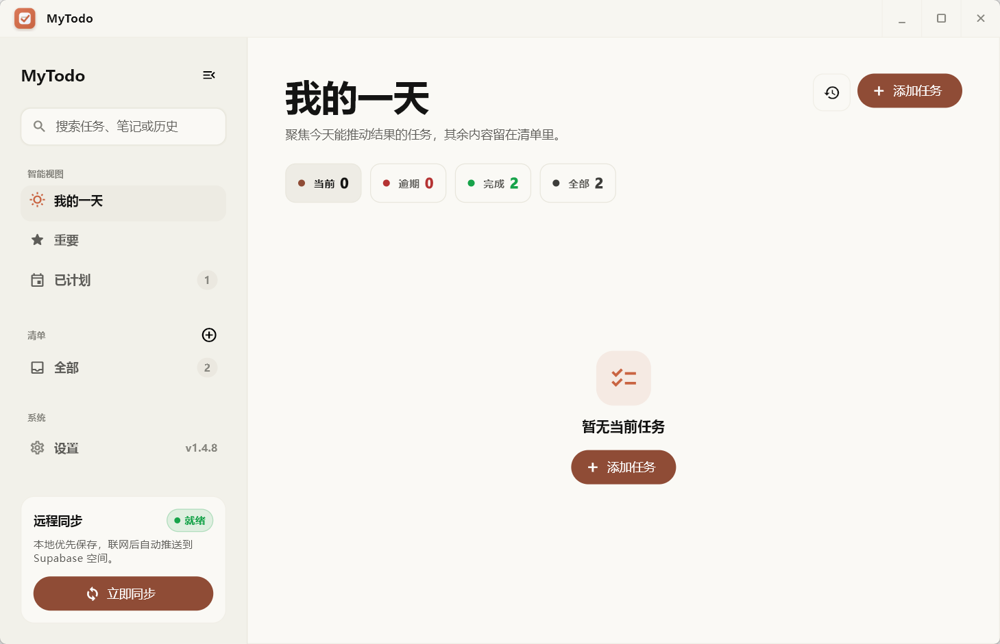

# MyTodo

[English](README.md) | [产品规划](docs/PRODUCT_ROADMAP.md)

MyTodo 是一个支持 Windows 和 Android 的本地优先 TODO 应用。数据默认保存在本机，也可以配置你自己的 Supabase 项目进行远程同步。

## 运行截图

### Windows



### Android


## ✨ 功能特性

### 任务管理
- ✅ 添加、编辑、完成、删除和恢复 TODO
- ✅ 截止时间、提醒时间和逾期状态
- ✅ 重要任务星标标记
- ✅ 自定义清单和颜色
- ✅ 日常任务模板（每日自动生成）
- ✅ 拖拽排序（手动调整任务顺序）
- ✅ 新建任务默认设为当天截止

### 视图和筛选
- ✅ 我的一天 — 今日待办
- ✅ 重要 — 标星任务
- ✅ 已计划 — 有截止日期的任务
- ✅ 收集箱和自定义清单
- ✅ 当前、逾期、已完成筛选
- ✅ 历史搜索（当前、已完成、已删除任务）

### 同步与数据
- ✅ Supabase 远程同步（可选，需自配项目）
- ✅ 本地任务变化后自动触发远程同步
- ✅ 下拉刷新同步（移动端）/ 顶栏同步按钮（桌面端）
- ✅ 导出 JSON 备份

### 桌面特性
- ✅ 双栏布局：左侧导航 + 右侧任务详情
- ✅ Windows 系统托盘（显示/隐藏/同步/退出）
- ✅ Windows 11 Fluent Design 风格，暖色极简配色
- ✅ 应用内更新检查（GitHub + 国内镜像）
- ✅ Windows 安装程序和便携版 zip

## 📥 下载

最新版 APK、Windows 安装程序和 Windows 压缩包在这里下载：

https://github.com/tensortensor666/MyToDo/releases/latest

大多数 Android 手机使用 `arm64-v8a` APK。Windows 普通用户建议使用安装程序；免安装运行可下载 Windows zip。

## 🛠️ 本地构建

**前置要求:** Flutter 3.44+ / Dart 3.12+

```powershell
flutter pub get
flutter test
flutter build apk --release --split-per-abi --obfuscate --split-debug-info=build/symbols/android
flutter build windows --release
```

## 📦 发布

推送版本标签即可通过 GitHub Actions 自动构建发布：

```powershell
git tag -a v1.5.0 -m "MyTodo 1.5.0"
git push origin main
git push origin v1.5.0
```

[发布工作流](.github/workflows/release.yml) 自动上传 Android 分包 APK、Windows x64 便携版、安装程序和 SHA256 校验文件。

## 📚 文档

- [产品规划](docs/PRODUCT_ROADMAP.md)
- [UI 改善指南](docs/UI_IMPROVEMENT_GUIDE.md)
- [Android 发布签名](docs/android_release_signing.md)
- [Supabase 数据库表结构](docs/supabase_schema.sql)

## 🔧 技术栈

- **框架:** Flutter 3.44+
- **UI:** Fluent UI 4.16 + Material
- **数据库:** SQLite (sqflite)
- **同步:** HTTP + Supabase REST API
- **平台:** Windows, Android

## 📄 许可证

MIT — 详见 [LICENSE](LICENSE)。
